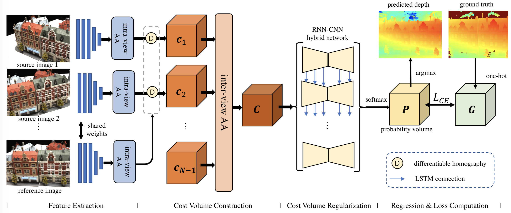

# AA-RMVSNet
Implementation of AA-RMVSNet in PyTorch.


## Data Preparation
- Download the preprocessed [DTU training data](https://drive.google.com/file/d/1eDjh-_bxKKnEuz5h-HXS7EDJn59clx6V/view) (also available at [Baiduyun](https://pan.baidu.com/s/1Wb9E6BWCJu4wZfwxm_t4TQ#list/path=%2F), PW: s2v2).
- For other datasets, please follow the practice in [Yao Yao's MVSNet repo](https://github.com/YoYo000/MVSNet).
- The [pretrained model]() is provided. Place it under `./checkpoints/`.


## How to run
1. Install required dependencies:
   ```bash
   conda create -n drmvsnet python=3.6
   conda activate drmvsnet
   conda install pytorch==1.1.0 torchvision==0.3.0 cudatoolkit=10.0 -c pytorch
   conda install -c conda-forge py-opencv plyfile tensorboardx
   ```
2. Set root of datasets as env variables in `env.sh`.
3. Train AA-RMVSNet on DTU dataset (note that training requires a large amount of GPU memory):
   ```bash
   ./scripts/train_dtu.sh
   ```
4. Predict depth maps and fuse them to get point clouds of DTU:
   ```bash
   ./scripts/eval_dtu.sh
   ./scripts/fusion_dtu.sh
   ```
6. Predict depth maps and fuse them to get point clouds of Tanks and Temples:
   ```bash
   ./scripts/eval_tnt.sh
   ./scripts/fusion_tnt.sh
   ```

Note: if permission issues are encountered, try `chmod +x filename` to allow execution.


## Citation   

```
@article{YourName,
  title={Your Title},
  author={Your team},
  journal={Location},
  year={Year}
}
```

## Acknowledgements
This repository is heavily based on [Xiaoyang Guo](https://github.com/xy-guo/MVSNet_pytorch)'s PyTorch implementation.

