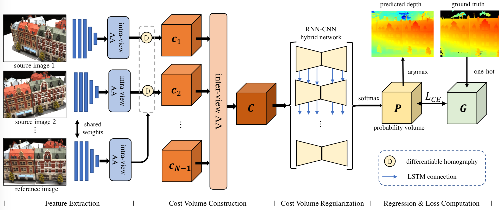
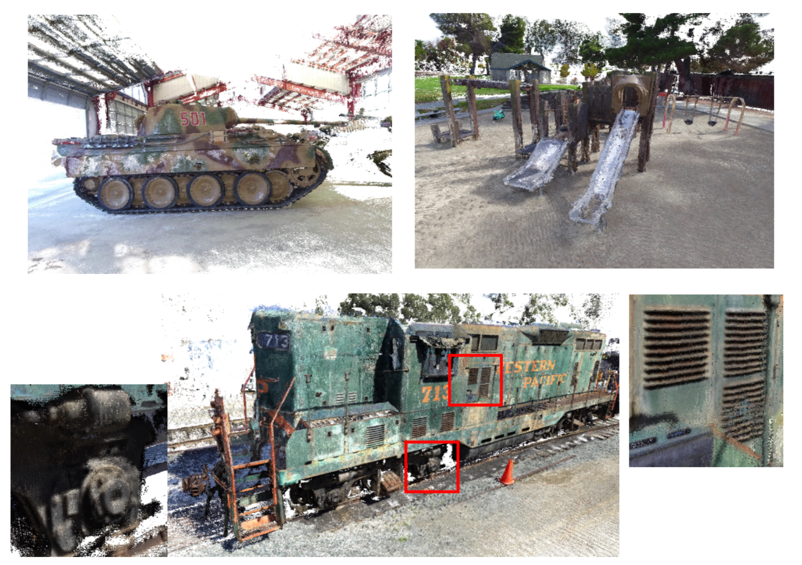

# AA-RMVSNet
Code for AA-RMVSNet: Adaptive Aggregation Recurrent Multi-view Stereo Network (ICCV 2021) in PyTorch. 

paper link: [arXiv](https://arxiv.org/abs/2108.03824) | [CVF](http://openaccess.thecvf.com/content/ICCV2021/html/Wei_AA-RMVSNet_Adaptive_Aggregation_Recurrent_Multi-View_Stereo_Network_ICCV_2021_paper.html)




## Change Log
- Jun 17, 2021: Initialize repo
- Jun 27, 2021: Update code
- Aug 10, 2021: Update paper link
- Oct 14, 2021: Update bibtex
- May 23, 2022: Update network architecture & pretrained model


## Data Preparation
- Download the preprocessed [DTU training data](https://drive.google.com/file/d/1eDjh-_bxKKnEuz5h-HXS7EDJn59clx6V/view) (also available at [BaiduYun](https://pan.baidu.com/s/1Wb9E6BWCJu4wZfwxm_t4TQ#list/path=%2F), PW: s2v2).
- For other datasets, please follow the practice in [Yao Yao's MVSNet repo](https://github.com/YoYo000/MVSNet).
- Note that the newly released pretrained models are not compatible with the old codebase. Please update the code as well.


## How to run
1. Install required dependencies:
   ```bash
   conda create -n drmvsnet python=3.6
   conda activate drmvsnet
   conda install pytorch==1.1.0 torchvision==0.3.0 cudatoolkit=10.0 -c pytorch
   conda install -c conda-forge py-opencv plyfile tensorboardx
   ```
2. Set root of datasets as env variables in `env.sh`.
3. Train AA-RMVSNet on DTU dataset (note that training requires a large amount of GPU memory):
   ```bash
   ./scripts/train_dtu.sh
   ```
4. Predict depth maps and fuse them to get point clouds of DTU:
   ```bash
   ./scripts/eval_dtu.sh
   ./scripts/fusion_dtu.sh
   ```
6. Predict depth maps and fuse them to get point clouds of Tanks and Temples:
   ```bash
   ./scripts/eval_tnt.sh
   ./scripts/fusion_tnt.sh
   ```
   Note: if permission issues are encountered, try `chmod +x <script_filename>` to allow execution.

## Citation   

```
@inproceedings{wei2021aa,
  title={AA-RMVSNet: Adaptive Aggregation Recurrent Multi-view Stereo Network},
  author={Wei, Zizhuang and Zhu, Qingtian and Min, Chen and Chen, Yisong and Wang, Guoping},
  booktitle={Proceedings of the IEEE/CVF International Conference on Computer Vision},
  pages={6187--6196},
  year={2021}
}
```

## Acknowledgements
This repository is heavily based on [Xiaoyang Guo's PyTorch implementation](https://github.com/xy-guo/MVSNet_pytorch).

